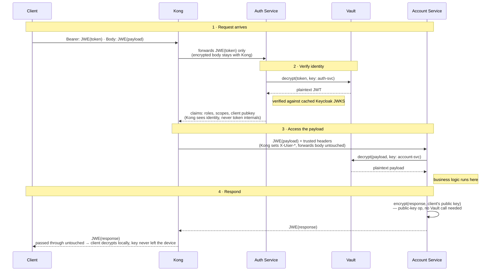

# Who gets to see what, and when

Target-state workflow for payload encryption, with per-service keys held in
Vault. **What's actually implemented today is a simpler version of this** —
see the note at the bottom.

Kong never decrypts anything. Auth Service only ever sees identity.
Account Service only ever sees its own payload. And no service — not
one — holds a private key. Every decrypt is a call to Vault; Vault
answers with plaintext and keeps the key.

An interactive, annotated version of this diagram (color-coded by data
state, with a Vault boundary callout) is published at:
https://claude.ai/code/artifact/487b2d0d-596a-4139-9ed1-a869a647a255

## Sequence

## Reading the diagram

- **Ciphertext hops** (`Client→Kong`, `Kong→AuthService`, `AuthService→Vault`,
  `Kong→AccountService`, `AccountService→Vault`, the whole response leg): the
  payload crossing that arrow is still encrypted — opaque to whoever's
  relaying it.
- **Plaintext hops** (`Vault→AuthService`, `AuthService→Kong`,
  `Vault→AccountService`): the data has just been decrypted *for the party
  that received it* — visible to them, no one upstream or downstream.
- **Vault**: everything that touches it goes in as ciphertext and comes back
  as plaintext. The key that did the decryption never crosses that boundary
  — services call Vault, they never hold a key themselves.

## Why it's built this way

- **Steps 3 and 7** (both `→Vault` decrypt calls) are the same operation on
  two different keys. Auth Service can only ask Vault for `auth-svc`'s key;
  Account Service can only ask for its own. Neither can reach the other's
  data even if compromised.
- **Step 9** is the only step that never touches Vault. Encrypting *for*
  someone only ever needs their public key, not a secret — there's nothing
  for Vault to guard there.
- **Kong's entire job in this flow** is steps 2 and 6: hand the token to
  Auth Service, forward whatever comes back. It reads claims to set
  `X-User-*` headers; it never reads a token or a payload.

## Related

- Token JWE decryption + JWT verification: `auth-service/src/server.ts`
- Claims caching: `kong/plugins/custom-auth/handler.lua`
- Architecture and trade-offs for the token half of this flow: [`README.md`](../README.md)

## What's actually implemented vs. this diagram

The repo currently implements a **simplified version** of steps 1–4:
`account-service`'s `POST /accounts/transfer` route encrypts its request and
response, but reuses Auth Service's *existing* token key rather than a
separate Vault-issued key — Account Service never holds any key material at
all. Concretely, the differences from the diagram above:

- **Step 7** (`AccountService→Vault: decrypt(payload)`) doesn't happen —
  there's no Vault, and Account Service has no key. Instead, Auth Service
  decrypts the request payload in the same `/validate` call that decrypts
  the token (same key, one extra `try`/`catch`), and Kong rewrites the
  upstream request body with the plaintext before it reaches Account
  Service. Account Service receives ordinary JSON, no crypto code needed on
  the request side.
- **Step 9** (`encrypt(response, client's public key)`) is **not
  implemented at all** — the response is plain JSON. It was tried using
  Auth Service's key (same as everything else, for consistency with step 7),
  but that has a real consequence: only Auth Service's private key can
  decrypt something encrypted with its public key, so the client can't read
  its own response without an extra round trip back through Auth Service to
  decrypt it. That round trip was judged not worth it, so response
  encryption was removed rather than kept in that shape. This diagram's
  step 9 — encrypt with the *client's* key, not Auth Service's — is still
  the way to do this without that limitation, if it's revisited.
- There is no Vault container in this repo. The governance discussion this
  diagram documents (why private keys shouldn't be loaded into every
  business service) remains the reasoning for *not* giving Account Service
  a key of its own — the simplified implementation satisfies that by giving
  it no key at all, rather than by adding Vault.

See the "Test payload encryption" section in [`README.md`](../README.md) for
how to run it.
