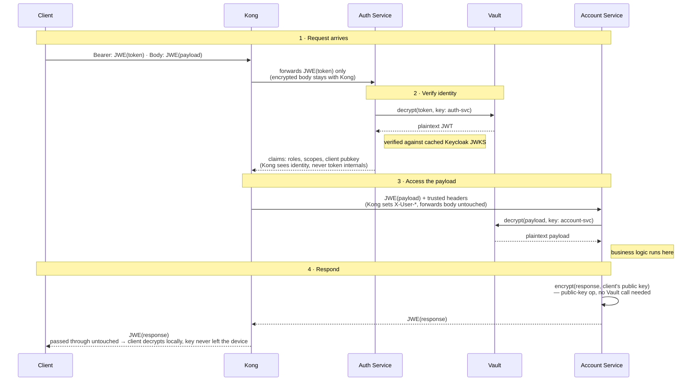
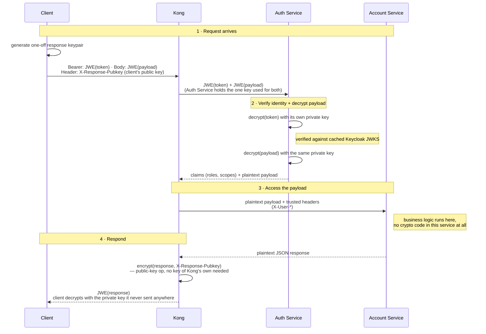

# Who gets to see what, and when

Target-state workflow for payload encryption, with per-service keys held in
Vault. **What's actually implemented today is a simpler version of this** —
see the note at the bottom.

Kong never decrypts anything. Auth Service only ever sees identity.
Account Service only ever sees its own payload. And no service — not
one — holds a private key. Every decrypt is a call to Vault; Vault
answers with plaintext and keeps the key.

An interactive, annotated version of this diagram (color-coded by data
state, with a Vault boundary callout) is published at:
https://claude.ai/code/artifact/487b2d0d-596a-4139-9ed1-a869a647a255

## Sequence

## Sequence — implemented today

The diagram above is target-state (Vault, per-service keys, Account Service
encrypting its own response). What's actually running in this repo right now
is simpler — no Vault, one shared key on the Auth Service side for the
request, and Kong (not Account Service) encrypting the response using a key
the client supplies:

## Reading the diagram

- **Ciphertext hops** (`Client→Kong`, `Kong→AuthService`, `AuthService→Vault`,
  `Kong→AccountService`, `AccountService→Vault`, the whole response leg): the
  payload crossing that arrow is still encrypted — opaque to whoever's
  relaying it.
- **Plaintext hops** (`Vault→AuthService`, `AuthService→Kong`,
  `Vault→AccountService`): the data has just been decrypted *for the party
  that received it* — visible to them, no one upstream or downstream.
- **Vault**: everything that touches it goes in as ciphertext and comes back
  as plaintext. The key that did the decryption never crosses that boundary
  — services call Vault, they never hold a key themselves.

## Why it's built this way

- **Steps 3 and 7** (both `→Vault` decrypt calls) are the same operation on
  two different keys. Auth Service can only ask Vault for `auth-svc`'s key;
  Account Service can only ask for its own. Neither can reach the other's
  data even if compromised.
- **Step 9** is the only step that never touches Vault. Encrypting *for*
  someone only ever needs their public key, not a secret — there's nothing
  for Vault to guard there.
- **In this diagram**, Kong's entire job is steps 2 and 6: hand the token to
  Auth Service, forward whatever comes back. It reads claims to set
  `X-User-*` headers; it never reads a token or a payload. (In what's
  actually implemented today, Kong also does step 9's response encryption —
  see the note below — which is a deliberate deviation from this
  "Kong never decrypts or encrypts anything" framing, made because the
  operation needs no secret, only a client-supplied public key.)

## Related

- Token + request payload JWE decryption, JWT verification:
  `auth-service/src/server.ts`
- Claims caching, response JWE encryption:
  `kong/plugins/custom-auth/handler.lua`
- Architecture and trade-offs for the token half of this flow: [`README.md`](../README.md)

## What's actually implemented vs. this diagram

The repo currently implements a **simplified version** of steps 1–4:
`account-service`'s `POST /accounts/transfer` route encrypts its request and
response, but reuses Auth Service's *existing* token key rather than a
separate Vault-issued key — Account Service never holds any key material at
all. Concretely, the differences from the diagram above:

- **Step 7** (`AccountService→Vault: decrypt(payload)`) doesn't happen —
  there's no Vault, and Account Service has no key. Instead, Auth Service
  decrypts the request payload in the same `/validate` call that decrypts
  the token (same key, one extra `try`/`catch`), and Kong rewrites the
  upstream request body with the plaintext before it reaches Account
  Service. Account Service receives ordinary JSON, no crypto code needed on
  the request side.
- **Step 9** (`encrypt(response, client's public key)`) **is implemented**,
  but by **Kong**, not Account Service — a deliberate deviation from this
  diagram. Two earlier attempts were tried and backed out: encrypting with
  Auth Service's key (only Auth Service could then decrypt it — the client
  would need a round trip back through Auth Service to read its own
  response) and encrypting in Account Service with the client's key (works,
  but puts JWE crypto code in the one service that's supposed to stay
  crypto-free on both the request *and* response side). Landing it in Kong
  instead keeps Account Service exactly as thin as the request side already
  made it: plain JSON in, plain JSON out, no crypto code anywhere in the
  service. Concretely: `client-simulator` generates a one-off RSA-OAEP
  keypair per transfer request and sends the public half as a plain
  `X-Response-Pubkey` header (base64url-encoded JWK) alongside the encrypted
  request body. It's not sensitive — it grants no authority, it only says
  "encrypt the answer to this" — so Kong reads it without any trust check.
  Account Service returns its normal plaintext JSON; Kong's `response` phase
  (`kong/plugins/custom-auth/handler.lua`) picks up the full buffered body,
  encrypts it with that key using `resty.openssl` (RSA-OAEP-256 key wrap +
  A256GCM content encryption, hand-assembled into JWE compact
  serialization), and returns `application/jwe`. The client decrypts
  locally with the private half it never sent anywhere. No Vault call
  needed for this step, same as the diagram notes: encrypting *for* someone
  is a public-key operation, not a secret one. A config flag
  (`encrypt_response`, default `true`) lets a route opt out.
- There is no Vault container in this repo. The governance discussion this
  diagram documents (why private keys shouldn't be loaded into every
  business service) remains the reasoning for *not* giving Account Service
  a key of its own on the request side — the simplified implementation
  satisfies that by giving it no key at all, rather than by adding Vault.
  The response side goes a step further than the diagram: instead of giving
  *Account Service* the client's public key, Kong holds it only for the
  span of one request/response pair, and only ever performs a public-key
  operation with it — there's no secret material in Kong to protect either.

See the "Test payload encryption" section in [`README.md`](../README.md) for
how to run it.
