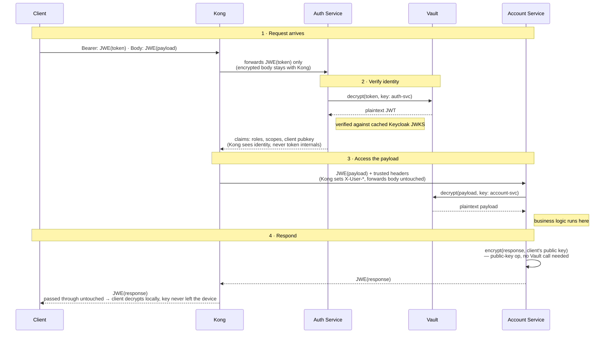

# Who gets to see what, and when

Workflow for the (proposed, not yet implemented) payload encryption layer,
alongside the token encryption already built in this repo.

Kong never decrypts anything. Auth Service only ever sees identity.
Account Service only ever sees its own payload. And no service — not
one — holds a private key. Every decrypt is a call to Vault; Vault
answers with plaintext and keeps the key.

An interactive, annotated version of this diagram (color-coded by data
state, with a Vault boundary callout) is published at:
https://claude.ai/code/artifact/487b2d0d-596a-4139-9ed1-a869a647a255

## Sequence

## Reading the diagram

- **Ciphertext hops** (`Client→Kong`, `Kong→AuthService`, `AuthService→Vault`,
  `Kong→AccountService`, `AccountService→Vault`, the whole response leg): the
  payload crossing that arrow is still encrypted — opaque to whoever's
  relaying it.
- **Plaintext hops** (`Vault→AuthService`, `AuthService→Kong`,
  `Vault→AccountService`): the data has just been decrypted *for the party
  that received it* — visible to them, no one upstream or downstream.
- **Vault**: everything that touches it goes in as ciphertext and comes back
  as plaintext. The key that did the decryption never crosses that boundary
  — services call Vault, they never hold a key themselves.

## Why it's built this way

- **Steps 3 and 7** (both `→Vault` decrypt calls) are the same operation on
  two different keys. Auth Service can only ask Vault for `auth-svc`'s key;
  Account Service can only ask for its own. Neither can reach the other's
  data even if compromised.
- **Step 9** is the only step that never touches Vault. Encrypting *for*
  someone only ever needs their public key, not a secret — there's nothing
  for Vault to guard there.
- **Kong's entire job in this flow** is steps 2 and 6: hand the token to
  Auth Service, forward whatever comes back. It reads claims to set
  `X-User-*` headers; it never reads a token or a payload.

## Related

- Token JWE decryption + JWT verification: `auth-service/src/server.ts`
- Claims caching: `kong/plugins/custom-auth/handler.lua`
- Architecture and trade-offs for the token half of this flow: [`README.md`](../README.md)
- Payload encryption/decryption at the business-service layer, and Vault/KMS
  key governance, are discussed but **not yet implemented** in this repo.
