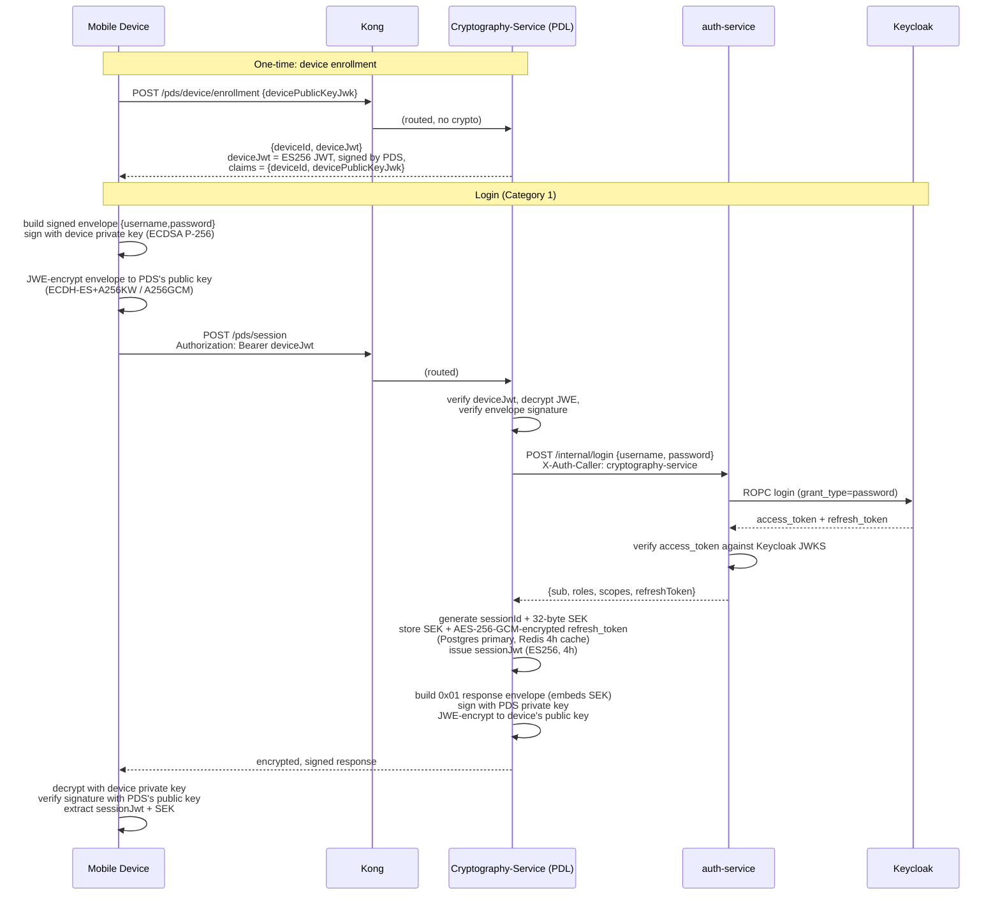
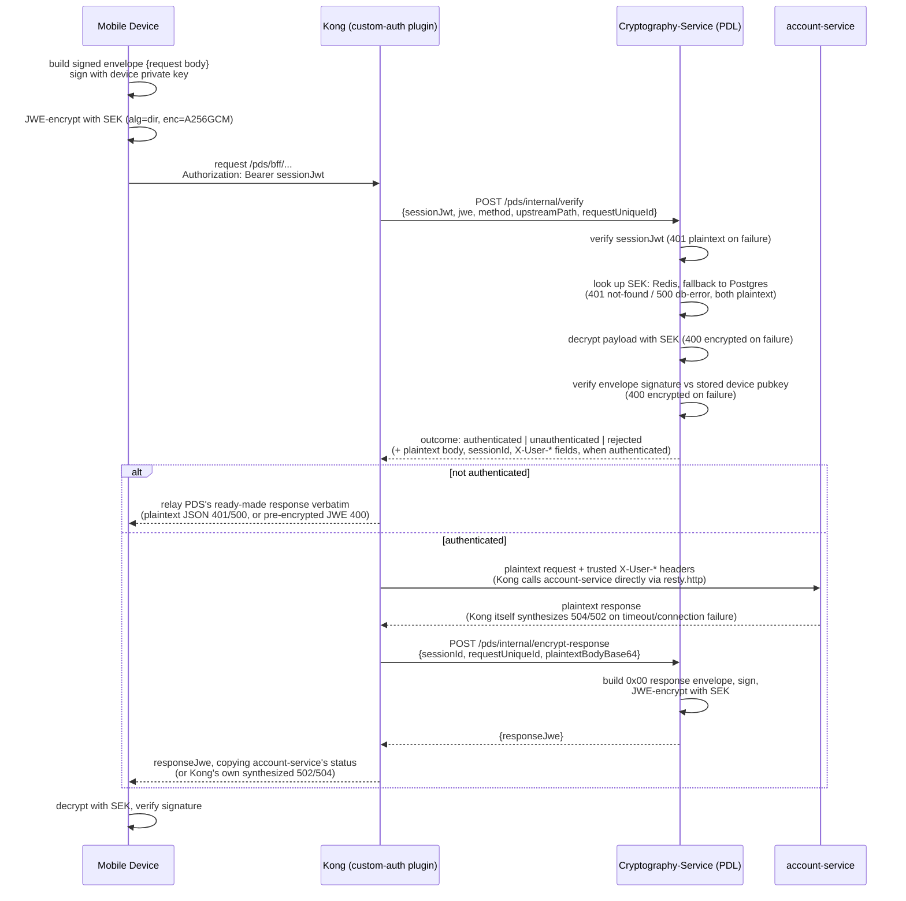
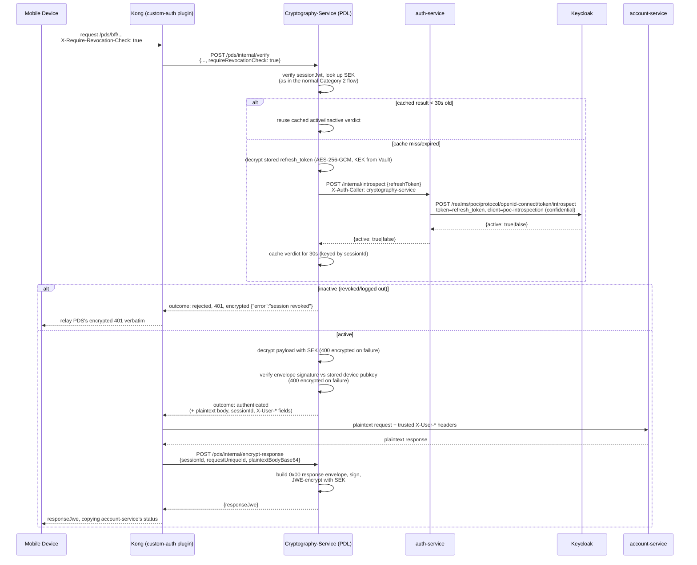

# Payload Decryptor Service (PDS): request/response encryption

This documents the payload-encryption architecture implemented in this repo,
following the formal spec in `requirement /Decryption-130826-131559.pdf`
("Request Payload Encryption / Decryption"). It replaces an earlier,
simpler proof-of-concept (shared RSA-OAEP key, no signing, no sessions, no
Vault) that used to live at this same doc path — see "Deviations from the
spec" below for what's still simplified relative to the PDF.

The PDS's job: every request/response body between the mobile client and the
backend BFF APIs is wrapped in a signed binary envelope, then JWE-encrypted.
All decrypt/verify/re-encrypt logic (and every key) lives in `Cryptography-Service`
(the PDS) — Kong never holds a SEK or a PDS key. `Cryptography-Service` in
turn never talks to Keycloak directly: all ROPC login, access-token
verification, and refresh-token introspection is delegated to a separate
`auth-service` over two internal, `X-Auth-Caller`-gated endpoints
(`/internal/login`, `/internal/introspect`) — `Cryptography-Service` holds
every crypto key, `auth-service` holds no keys and just brokers Keycloak
calls. Kong's role differs by category:

- **Category 1** (device enrollment, session acquiring) and the PDS JWKS
  endpoint: pure pass-through. Kong routes the request to `Cryptography-Service` and
  relays whatever comes back, no crypto logic of its own.
- **Category 2/3** (`/pds/bff/*`): Kong's `custom-auth` plugin
  (`kong/plugins/custom-auth/handler.lua`) actively brokers the request — it
  asks the PDS to verify+decrypt, forwards the resulting plaintext to
  `account-service` itself, then asks the PDS to encrypt the reply. See the
  Category 2 sequence below.

This is a deliberate choice to keep Kong as the point that checks "is this
request's auth complete" and owns the actual proxy hop to the business
service, rather than the PDS calling `account-service` directly end-to-end
(the PDF's own diagram (p.1) shows the PDS calling the BFF directly — this
repo's Category 2 flow is one step removed from that, with Kong doing the
forwarding instead once the PDS has vouched for the request).

## Category 1 — Session Acquiring

## Category 2 — other ONEApp BFF API

Kong's `custom-auth` plugin brokers this category — it's the one place in
this repo where Kong does more than route. The plugin makes two calls back
to the PDS per request (once to verify+decrypt, once to encrypt the reply)
and one call to `account-service` itself; it never runs Kong's own
declarative-service proxy for this route (the plugin's access phase always
answers the request directly via `kong.response.exit`, so Kong core's proxy
phase for the route's nominal upstream never actually fires).

The two PDS calls (`/pds/internal/verify`, `/pds/internal/encrypt-response`)
are internal-only — gated by an `X-Auth-Caller: kong` header, same
convention this repo has used since the very first version of this plugin.
The SEK itself never leaves the PDS/Vault boundary: Kong only ever sees
ciphertext on the wire to/from the device, plaintext for the single hop to
`account-service`, and the PDS's already-built ciphertext coming back.

## Real-time revocation checking (opt-in, Category 2/3)

Session validity is normally bounded only by the 4-hour `sessionJwt`/SEK
lifetime — the PDS never checks back with Keycloak on ordinary Category 2/3
requests. A client can opt a single request into a live check by sending
`X-Require-Revocation-Check: true`; Kong forwards that as
`requireRevocationCheck` on its existing `/pds/internal/verify` call, no
extra round trip between Kong and the PDS. The PDS then asks `auth-service`
to introspect the Keycloak **refresh token** captured at login (RFC 7662),
not the access
token — Keycloak's `accessTokenLifespan` here is 120 seconds, far shorter
than the 4h session this check protects, so the access token would read
"inactive" almost immediately for reasons unrelated to revocation. A
revoked/logged-out Keycloak session invalidates its refresh tokens too, so
introspecting the refresh token still reflects live revocation state.

Introspection uses a separate confidential client (`poc-introspection`) from
the public `poc-client` used for login — Keycloak rejects introspection
calls authenticated as a public client. Since the rejection happens after
the SEK lookup, the 401 body is encrypted like other Category 2 errors
rather than plaintext.

## Category 3 — MiniApp BFF API

Identical request/response flow to Category 2. The only difference is where
the SEK comes from: Category 2 reads Redis with a Postgres fallback (both
owned by this PDS deployment); Category 3 — running in a MiniApp's own
environment, unable to reach this PDS's database — instead calls a "Session
Encryption Key Inquiry API" over HTTP. In this repo that's a config
switch (`PDS_SEK_SOURCE=http`), not a separate deployment: setting it points
`lookupSekViaInquiry()` at `PDS_SEK_INQUIRY_URL`, which for this POC is a
self-referential stub (`GET /pds/internal/sek-inquiry/:sessionId` on the same
service) that proves the alternate-source code path exists without standing
up a second PDS instance.

## Payload layout

Every request/response payload is wrapped in this binary envelope *before*
JWE encryption (request) / *after* JWE decryption (response). Implemented in
`Cryptography-Service/src/pds/envelope.ts` and mirrored in
`client-simulator/src/envelope.ts`.

**Signed request envelope:**

| Field | Size | Notes |
|---|---|---|
| `signatureLength` | 2 bytes, big-endian | ECDSA P-256 DER signature is 70-72 bytes |
| `signature` | `signatureLength` bytes | ASN.1 DER, covers everything below |
| `requestStructureType` | 1 byte | `0x00` = "Standard Request V1" |
| `requestTimeStamp` | 8 bytes, big-endian | Unix epoch, milliseconds |
| `apiId` | 4 bytes, big-endian | Static per-API id, see `apiRegistry.ts` |
| `requestUniqueIdLength` | 1 byte | 0-255 |
| `requestUniqueId` | `requestUniqueIdLength` bytes | UTF-8; matched against `X-Client-Transaction-Id` if present |
| `originalRequestPayload` | remainder | Raw request body, unmodified |

**Signed response envelope, `responseStructureType = 0x00`** ("Standard
Response V1", used everywhere except Category 1's session-acquiring
response):

| Field | Size |
|---|---|
| `signatureLength` | 2 bytes |
| `signature` | `signatureLength` bytes |
| `responseStructureType` | 1 byte (`0x00`) |
| `responseTimeStamp` | 8 bytes |
| `requestUniqueIdLength` | 1 byte |
| `requestUniqueId` | `requestUniqueIdLength` bytes |
| `originalResponsePayload` | remainder |

**Signed response envelope, `responseStructureType = 0x01`** ("Session
Acquiring Response V1", Category 1 only) — same as above with a 32-byte
`sessionEncryptionKey` field inserted after the timestamp:

| Field | Size |
|---|---|
| `signatureLength` | 2 bytes |
| `signature` | `signatureLength` bytes |
| `responseStructureType` | 1 byte (`0x01`) |
| `responseTimeStamp` | 8 bytes |
| `sessionEncryptionKey` | 32 bytes |
| `requestUniqueIdLength` | 1 byte |
| `requestUniqueId` | `requestUniqueIdLength` bytes |
| `originalResponsePayload` | remainder |

## Key material

| Key | Generated | Held by | Purpose |
|---|---|---|---|
| `pdsEncKeyPair` (EC P-256) | PDS startup, once (persisted in Vault) | Vault (`secret/data/pds/ec-enc-keypair`) | `ECDH-ES+A256KW` target for Category 1 request decryption / response encryption |
| `pdsSignKeyPair` (EC P-256) | PDS startup, once (persisted in Vault) | Vault (`secret/data/pds/ec-sign-keypair`) | ES256-signs `deviceJwt`, `sessionJwt`, and every response envelope |
| Device keypair (EC P-256) | Client, once, persisted locally | Client only (private half never leaves the device) | Signs every request envelope; also the `ECDH-ES+A256KW` target for the Category 1 response (see deviation below) |
| SEK (AES-256) | PDS, per session | Postgres (AESWrap-wrapped) + Redis (4h cache); device via the Category 1 response | `dir`+`A256GCM` content key for all Category 2/3 request/response bodies |
| SEK-wrap KEK (AES-256) | PDS startup, once (persisted in Vault) | Vault (`secret/data/pds/sek-wrap-kek`) | RFC 3394 AESWrap key-encryption-key protecting SEKs at rest in Postgres; also encrypts the refresh token below (`tokenCrypto.ts`) |
| Keycloak refresh token | Keycloak, per login (ROPC), fetched via `auth-service` | Postgres (AES-256-GCM-encrypted) + Redis (4h cache), inside `Cryptography-Service`; never sent to the device or held by `auth-service` | Introspected (RFC 7662) for the opt-in `X-Require-Revocation-Check` on Category 2/3 |

`auth-service` itself holds no key material — it only brokers Keycloak ROPC
login and RFC 7662 introspection for `Cryptography-Service` over two
internal endpoints (`POST /internal/login`, `POST /internal/introspect`,
both gated by `X-Auth-Caller: cryptography-service`).

## Deviations from the spec

- **Kong brokers Category 2/3 traffic, rather than the PDS calling
  account-service directly.** The PDF's own diagram (p.1) shows the PDS
  sitting directly in front of the BFF endpoints, with the gateway just
  routing to the PDS. This repo instead has the PDS hand verified,
  decrypted requests back to Kong (via `/pds/internal/verify`), Kong makes
  the actual call to `account-service`, and Kong asks the PDS to encrypt
  the reply (`/pds/internal/encrypt-response`) before relaying it. This
  costs an extra PDS round trip per Category 2/3 request compared to the
  PDF's design, in exchange for Kong being the place that visibly checks
  "is this request's auth complete" and owns the proxy hop to the business
  service — useful if the gateway tier wants that as an enforcement point
  independent of what the PDS does internally.
- **Postgres, not SQL Server memory-optimized+partitioned table.** The PDF
  (pp.12-14) specs a `SessionEncryptionKey` table as a SQL Server
  memory-optimized table with 24 physical partitions (one per
  `expiration_bucket`), cleaned up by `TRUNCATE PARTITION`. Postgres has no
  memory-optimized-table equivalent, and native list partitioning across 24
  child tables is real operational weight for a POC-scale table. This repo
  uses a single table with a btree index on `expiration_bucket`
  (`postgres/init/001-session-encryption-key.sql`) and an hourly `DELETE`
  (`Cryptography-Service/src/pds/cleanupJob.ts`) instead.
- **Category 3 is a config flag, not a separate deployment.** `PDS_SEK_SOURCE=http`
  swaps the SEK lookup's DB path for an HTTP call, but both code paths run
  in the same `Cryptography-Service` container — there's no second PDS instance
  simulating a MiniApp's isolated environment.
- **Multipart/form-data payload encryption is not implemented.** The PDF
  (pp.6-7) specs per-file AES-256-GCM encryption plus a `metaData` JWE part
  for `multipart/form-data` requests. No route in this repo uploads files,
  so `/pds/bff/*` returns `501` on that content type instead of building the
  pipeline against nothing.
- **The device reuses one EC P-256 keypair for both ECDSA signing and as the
  `ECDH-ES+A256KW` target for its Category 1 response**, rather than
  separate keys for each purpose. The PDF's own "Remark: We may choose to
  use different key-pair for request/response payload encryption" (p.3)
  already anticipated key separation as a future refinement; this repo
  hasn't done it for the device side. Note the PDS's *own* two keys
  (`pdsEncKeyPair` vs `pdsSignKeyPair`) do keep this separation.
- **Vault runs in dev mode**: unsealed, single root token, in-memory
  storage (state is lost if the Vault container itself restarts). A real
  deployment would use a persistent storage backend and scope an AppRole
  policy to only the three `pds/*` paths this service touches, instead of a
  shared root token.
- **`deviceJwt` has no real device attestation.** Device enrollment
  (`POST /pds/device/enrollment`) is a bare "post your public key, get a
  JWT" endpoint — no App Attest / Play Integrity / hardware-backed key
  attestation, unlike the PDF's reference to a real Keycloak-backed Device
  Enrollment API and `deviceJwt` claims structure.
- **Real-time revocation checking, restored on a different token.** The
  prior implementation in this repo supported an `X-Require-Revocation-Check`
  header that introspected the raw Keycloak *access* token on every request
  — that design assumed the access token itself was the session credential.
  It no longer fits now that Category 2/3 runs on a PDS-minted `sessionJwt`
  (4h) decoupled from Keycloak's own 120-second `accessTokenLifespan`. The
  header is back (see "Real-time revocation checking" above), but it now
  introspects the Keycloak **refresh token** captured once at Category 1
  login instead, since that reflects live Keycloak session state without
  expiring almost immediately like the access token would.

## Related

- Binary envelope codec: `Cryptography-Service/src/pds/envelope.ts`,
  `client-simulator/src/envelope.ts` (intentionally duplicated — no
  monorepo tooling in this repo, and the two sides are asymmetric: PDS
  mostly decodes requests and encodes responses, the client is the mirror).
- RFC 3394 AESWrap: `Cryptography-Service/src/pds/aesWrap.ts`.
- Vault key provisioning: `Cryptography-Service/src/pds/vaultClient.ts`.
- SEK storage (Redis cache-aside over Postgres): `Cryptography-Service/src/pds/sekStore.ts`.
- Refresh token encryption for revocation checks: `Cryptography-Service/src/pds/tokenCrypto.ts`.
- Hourly SEK cleanup: `Cryptography-Service/src/pds/cleanupJob.ts`.
- All PDS HTTP routes (device enrollment, session acquiring, the internal
  verify/encrypt-response endpoints Kong calls): `Cryptography-Service/src/server.ts`.
- Keycloak login and introspection, on behalf of `Cryptography-Service`:
  `auth-service/src/server.ts`.
- Client-side session/device flow: `client-simulator/src/pdsClient.ts`.
- Kong routing: `kong/kong.yml`. Category 2/3 auth-check-and-forward logic:
  `kong/plugins/custom-auth/handler.lua` (+ `schema.lua` for its config
  fields — `pds_verify_url`, `pds_encrypt_response_url`,
  `account_service_url`, `timeout_ms`).

See the "Test payload encryption" section in [`README.md`](../README.md) for
how to run this end to end.
