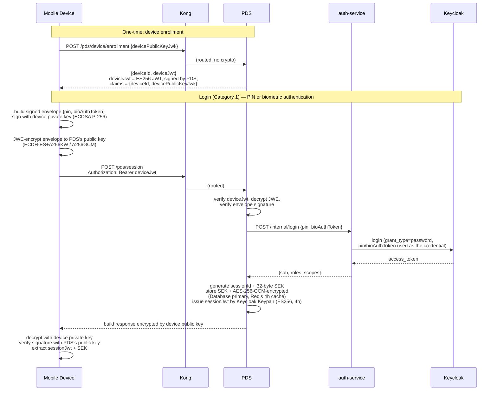
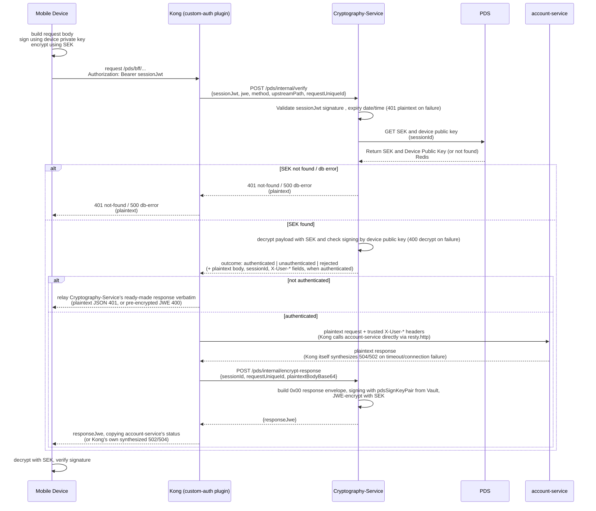
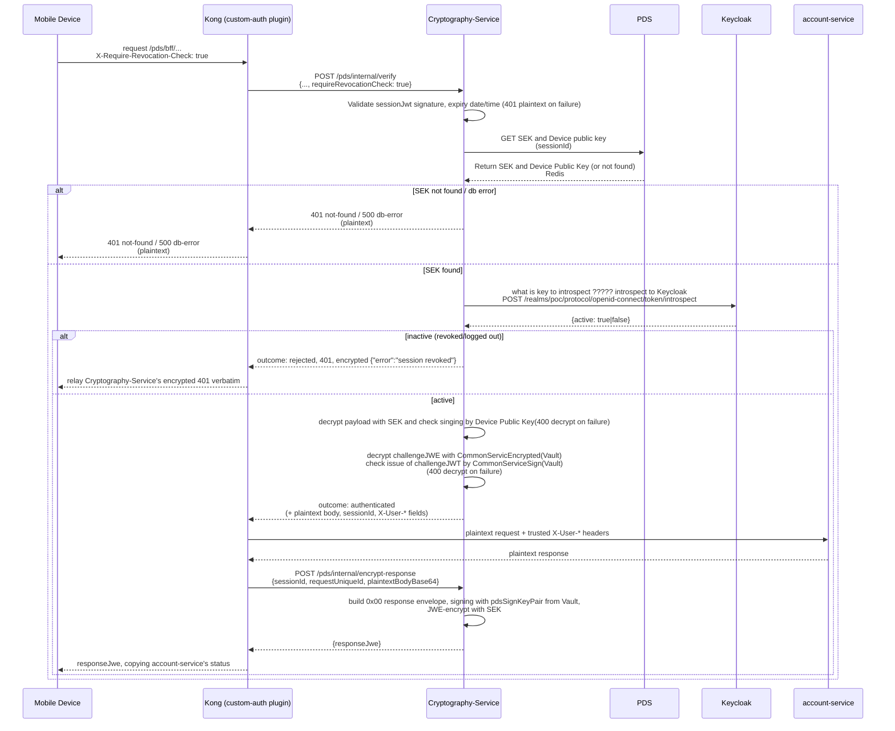

# Payload Decryptor Service (PDS): request/response encryption

## Category 1 — Session Acquiring

## Category 2 — other ONEApp BFF API

## Check with Challenge Token

## Key material

| Key | Generated | Held by | Purpose |
|---|---|---|---|
| `pdsEncKeyPair` (EC P-256) | PDS startup, once (persisted in Vault) | Vault (`secret/data/pds/ec-enc-keypair`) | `ECDH-ES+A256KW` target for Category 1 request decryption / response encryption |
| `pdsSignKeyPair` (EC P-256) | PDS startup, once (persisted in Vault) | Vault (`secret/data/pds/ec-sign-keypair`) | ES256-signs `deviceJwt`, `sessionJwt`, and every response envelope |
| Device keypair (EC P-256) | Client, once, persisted locally | Client only (private half never leaves the device) | Signs every request envelope; also the `ECDH-ES+A256KW` target for the Category 1 response (see deviation below) |
| SEK (AES-256) | PDS, per session | Database (AESWrap-wrapped) + Redis (4h cache); device via the Category 1 response | `dir`+`A256GCM` content key for all Category 2/3 request/response bodies |
| SEK-wrap KEK (AES-256) | PDS startup, once (persisted in Vault) | Vault (`secret/data/pds/sek-wrap-kek`) | RFC 3394 AESWrap key-encryption-key protecting SEKs at rest in Database; also encrypts the refresh token below (`tokenCrypto.ts`) |

